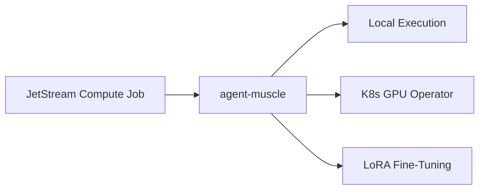

# agent-muscle

**Remote actuator — command execution, JetStream compute jobs, and LoRA fine-tuning.**

Part of the **[Autonomic AI](https://github.com/autonomic-ai-dev/agent-body)** ecosystem. Runs shell commands locally or via NATS, validates training datasets, and orchestrates MLX / candle / K8s GPU training pipelines.

| Standalone | Integrated |
|------------|------------|
| `agent-muscle run "cargo test"` | JetStream consumer on `autonomic.compute.job` |
| Dataset validation | Spine events on execute/train |
| HTTP **3103** | `[muscle]` in `~/.autonomic/config.toml` |

---

## Why agent-muscle?

| Problem | agent-muscle answer |
|---------|-------------------|
| Agents need sandboxed exec | **`run`** — subprocess execution with JSON result |
| Training data is malformed | **`validate --data`** — JSONL gate before GPU hours |
| Remote/async compute | **JetStream worker** — `serve` consumes compute jobs |
| GPU jobs on K8s | **`operator`** — scale train queue to cluster GPUs |



---

## Quick Install

```bash
curl -fsSL https://raw.githubusercontent.com/autonomic-ai-dev/agent-muscle/master/scripts/install.sh | bash
# or full stack:
curl -fsSL https://raw.githubusercontent.com/autonomic-ai-dev/agent-body/master/scripts/install-all-organs.sh | bash
```

Verify:

```bash
agent-muscle version
agent-muscle status
agent-muscle run "echo hello"
```

---

## Main features

| Feature | Setup | Why use it |
|---------|-------|------------|
| **Command execution** | `run <cmd>` | Actuator for agent-spine tool nodes |
| **Dataset validation** | `validate --data` | Catch bad JSONL before train |
| **LoRA training** | `train --backend auto` | MLX/candle local fine-tune |
| **Dry-run train** | `train --validate-only` | Config + data check without GPU |
| **JetStream worker** | `serve` | Async compute from NATS |
| **K8s operator** | `operator run/sync` | GPU job scaling |

---

## Commands

| Command | Description |
|---------|-------------|
| `run <cmd>` | Execute command, JSON result |
| `serve` | HTTP API + JetStream compute consumer |
| `train` | LoRA fine-tune (`--backend mlx\|candle\|auto`) |
| `validate --data PATH` | JSONL dataset gate |
| `operator run\|sync\|status` | K8s GPU scaling from train queue |
| `k8s render-job` | Emit GPU Job manifest |

---

## HTTP API

| Endpoint | Description |
|----------|-------------|
| `GET /health` | Daemon health |
| `POST /execute` | Run command |
| `POST /train/validate` | Dataset validation |
| `POST /train/run` | Start training pipeline |
| `GET /k8s/status` · `POST /k8s/sync` | GPU operator |

---

## Configuration

Sections `[muscle]`, `[train]`, `[k8s]` in `~/.autonomic/config.toml` (default port **3103**).

Train queue subject: `autonomic.muscle.train.request`

---

## Local setup

```bash
git clone https://github.com/autonomic-ai-dev/agent-muscle.git && cd agent-muscle
cargo build --release -p agent-muscle
cargo build --release -p agent-muscle --features candle   # optional CUDA probe
agent-muscle validate --data ./training_data
# with NATS running:
autonomic start && agent-muscle serve
```

---

## Development

```bash
cargo test --release -p agent-muscle
cargo build --release -p agent-muscle --features candle
```

---

## License

MIT
