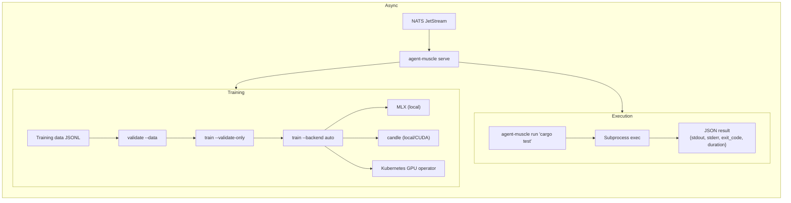

# agent-muscle — Remote Actuator and Training Pipeline

**Sandboxed command execution, LoRA fine-tuning (MLX/candle), dataset validation, and K8s GPU orchestration.**

agent-muscle is the **muscle** of the Autonomic AI ecosystem. It executes shell commands in a subprocess with JSON output, validates training datasets before expensive GPU runs, and orchestrates LoRA fine-tuning across local MLX/candle backends or remote Kubernetes GPU clusters.

The key design: **execution and training are separate pipelines with a shared validation gate.** Every command goes through a JSON-structured actuator that captures stdout, stderr, exit code, and duration. Every training run first validates the dataset format, model availability, and config — only then does it consume GPU hours.

---

## Core Concept

AI agents need to execute code and train models. But executing arbitrary shell commands is dangerous, and training on malformed data wastes expensive GPU hours.

agent-muscle provides two safe pipelines:

1. **Command execution** — subprocess execution with full JSON result (stdout, stderr, exit code, duration, success flag). No TTY, no interactive prompts, no unbounded execution.
2. **LoRA fine-tuning** — a validation-first pipeline: validate dataset JSONL structure → check model availability → dry-run config → actual training. Each step gates the next.

Both pipelines are accessible via CLI, HTTP API (`:3103`), and NATS JetStream (async compute jobs).



---

## Standalone vs Integrated

| Mode | What you type | What happens |
|------|--------------|--------------|
| **Standalone** | `agent-muscle run "cargo test"` | Execute command, JSON result to stdout |
| **Standalone** | `agent-muscle validate --data ./train.jsonl` | Validate dataset format and structure |
| **Standalone** | `agent-muscle train --validate-only` | Full pipeline check without GPU usage |
| **Standalone** | `agent-muscle serve` | HTTP API on `:3103` + JetStream consumer |
| **Integrated** | NATS JetStream | Consumes `autonomic.compute.job` subjects |
| **Integrated** | agent-spine | Executes workflow tool nodes via HTTP |
| **Integrated** | agent-heart | Triggers training when enough trajectories exist |

In standalone mode, muscle is a CLI tool for ad-hoc execution and training validation. In integrated mode, it runs as a daemon consuming async compute jobs from NATS and registering on the spine event bus.

---

## Why agent-muscle?

| Problem | agent-muscle answer |
|---------|-------------------|
| Agents need sandboxed command execution | **`run`** — subprocess with structured JSON result, no TTY |
| Training data is malformed — wasted GPU hours | **`validate --data`** — JSONL gate before any GPU allocation |
| Fine-tuning requires manual MLX/candle setup | **`train --backend auto`** — auto-detects available backend |
| GPU jobs need cluster orchestration | **`operator`** — scale training queue to K8s GPU nodes |
| Async compute requires a message queue | **JetStream worker** — `serve` consumes `autonomic.compute.job` |

---

## What you get

| Feature | Why use it |
|---------|------------|
| **Command execution** | `run <cmd>` — structured JSON result, safe subprocess isolation |
| **Dataset validation** | `validate --data` — catch bad JSONL before a GPU training run |
| **LoRA training** | `train --backend auto\|mlx\|candle` — local fine-tuning |
| **Dry-run training** | `train --validate-only` — config + data check without GPU |
| **JetStream worker** | `serve` — async compute from NATS subjects |
| **K8s operator** | `operator run/sync` — GPU job scaling from training queue |

---

## Commands

| Command | Description |
|---------|-------------|
| `agent-muscle run <cmd>` | Execute a command, return JSON result |
| `agent-muscle serve` | HTTP API daemon + JetStream compute consumer |
| `agent-muscle train` | LoRA fine-tuning (`--backend mlx\|candle\|auto`) |
| `agent-muscle validate --data PATH` | JSONL dataset validation gate |
| `agent-muscle operator run\|sync\|status` | K8s GPU scaling from training queue |
| `agent-muscle k8s render-job` | Emit a GPU Job manifest |
| `agent-muscle status` | Show actuator config, backends, dataset paths |

---

## HTTP API

| Method | Endpoint | Description |
|--------|----------|-------------|
| `GET` | `/health` | Daemon health and uptime |
| `POST` | `/execute` | Run a command |
| `POST` | `/train/validate` | Validate a training dataset |
| `POST` | `/train/run` | Start a training pipeline |
| `GET` | `/k8s/status` | K8s operator status |
| `POST` | `/k8s/sync` | Sync GPU job queue |

---

## Quick Install

```bash
curl -fsSL https://raw.githubusercontent.com/autonomic-ai-dev/agent-muscle/master/scripts/install.sh | bash

# Or full stack:
curl -fsSL https://raw.githubusercontent.com/autonomic-ai-dev/agent-body/master/scripts/install-all-organs.sh | bash
```

Verify:
```bash
agent-muscle version
agent-muscle status
agent-muscle run "echo hello"
```

---

## Configuration

Sections `[muscle]`, `[train]`, `[k8s]` in `~/.autonomic/config.toml` (default port **3103**).

Training queue subject: `autonomic.muscle.train.request`

---

## Development

```bash
git clone https://github.com/autonomic-ai-dev/agent-muscle.git && cd agent-muscle
cargo build --release -p agent-muscle
cargo build --release -p agent-muscle --features candle  # optional CUDA probe
cargo test --release -p agent-muscle
```

---

## License

MIT
