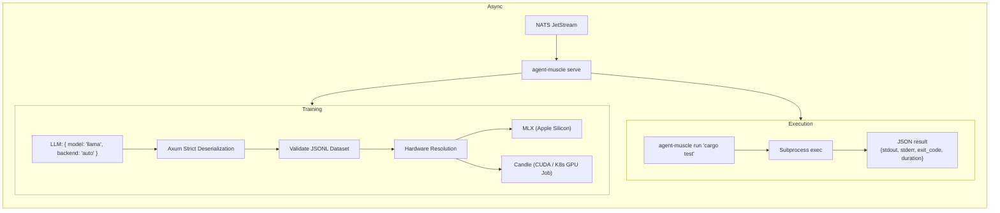

# agent-muscle — The Execution & Training Runtime

**Cloud-Native role: Execution runtime** (kubelet / CRI analog) — sandboxed command execution, strictly typed JSON APIs, and hardware-aware training job orchestration.

`agent-muscle` is the execution runtime for the Autonomic AI cluster. 
In a traditional AI framework, the LLM is forced to generate complex Python loops, parse stdout, and write massive Kubernetes YAML files character by character. This leads to the "JSON Tax"—wasted tokens and hallucinated syntax errors.

`agent-muscle` solves this by decoupling the LLM's reasoning from physical execution. The LLM outputs a tiny routing signal; `agent-muscle` catches it, deserializes it into strict Rust structs, and handles the heavy lifting natively.

---

## Under the Hood: How it Works

### 1. The Universal Execution Engine (`/execute`)
`agent-muscle` is not just for Kubernetes. It acts as the universal language execution runtime for your agents. 
If an agent wants to run a Python script, compile a Rust binary, or run a bash command, it sends a simple JSON payload to the `/execute` endpoint:

```json
{
  "command": "python3 script.py",
  "cwd": "/src/scripts"
}
```

`agent-muscle` natively spawns a secure subprocess (`sh -c`) on the host machine. It captures the `stdout`, `stderr`, the exact `exit_code`, and the `duration_ms`, and perfectly packages that back to the agent as a strict JSON result. You no longer need brittle `exec()` calls inside Python LLM scripts.

### 2. Deterministic ML Workloads (`/train/run`)
When an agent wants to fine-tune a model, it doesn't need to generate a 200-line Kubernetes GPU Job YAML. It sends a flat routing signal:

```json
{
  "model": "llama-8b",
  "data": "/dataset.jsonl",
  "backend": "auto"
}
```

Axum automatically deserializes this into a strict `RunTrainRequest` Rust struct. 
- **Validation:** Rust physically inspects the dataset file to ensure the JSONL format is correct *before* wasting GPU compute.
- **Hardware Resolution:** `agent-muscle` detects the host hardware. If running on an M-series Mac, it natively utilizes the **MLX** backend. If running on a Windows/Linux node, it falls back to the **Candle** backend (checking for local CUDA or routing to CPU).
- **Execution:** It uses `tokio::task::spawn_blocking` to natively run the training loop or construct the complex Kubernetes scheduling manifests.



---

## Standalone vs Integrated

| Mode | What you type | What happens |
|------|--------------|--------------|
| **Standalone** | `agent-muscle run "cargo test"` | Execute command, JSON result to stdout |
| **Standalone** | `agent-muscle validate --data ./train.jsonl` | Validate dataset format and structure |
| **Standalone** | `agent-muscle train --validate-only` | Full pipeline check without GPU usage |
| **Standalone** | `agent-muscle serve` | HTTP API on `:3103` + JetStream consumer |
| **Integrated** | NATS JetStream | Consumes `autonomic.compute.job` subjects |
| **Integrated** | agent-spine | Executes workflow tool nodes via HTTP |
| **Integrated** | agent-heart | Triggers training when enough trajectories exist |

In standalone mode, muscle is a CLI tool for ad-hoc execution and training validation. In integrated mode, it runs as a daemon consuming async compute jobs from NATS and registering on the spine event bus.

---

## Why agent-muscle?

| Problem | agent-muscle answer |
|---------|-------------------|
| Agents need sandboxed command execution | **`run`** — subprocess with structured JSON result, no TTY |
| Training data is malformed — wasted GPU hours | **`validate --data`** — JSONL gate before any GPU allocation |
| Fine-tuning requires manual MLX/candle setup | **`train --backend auto`** — auto-detects available backend |
| GPU jobs need cluster orchestration | **`operator`** — scale training queue to K8s GPU nodes |
| Async compute requires a message queue | **JetStream worker** — `serve` consumes `autonomic.compute.job` |

---

## What you get

| Feature | Why use it |
|---------|------------|
| **Command execution** | `run <cmd>` — structured JSON result, safe subprocess isolation |
| **Dataset validation** | `validate --data` — catch bad JSONL before a GPU training run |
| **LoRA training** | `train --backend auto\|mlx\|candle` — local fine-tuning |
| **Dry-run training** | `train --validate-only` — config + data check without GPU |
| **JetStream worker** | `serve` — async compute from NATS subjects |
| **K8s operator** | `operator run/sync` — GPU job scaling from training queue |

---

## Commands

| Command | Description |
|---------|-------------|
| `agent-muscle run <cmd>` | Execute a command, return JSON result |
| `agent-muscle serve` | HTTP API daemon + JetStream compute consumer |
| `agent-muscle train` | LoRA fine-tuning (`--backend mlx\|candle\|auto`) |
| `agent-muscle validate --data PATH` | JSONL dataset validation gate |
| `agent-muscle operator run\|sync\|status` | K8s GPU scaling from training queue |
| `agent-muscle k8s render-job` | Emit a GPU Job manifest |
| `agent-muscle status` | Show actuator config, backends, dataset paths |

Global `--progress` (or `AGENT_PROGRESS=1`) enables structured ProgressTree CLI output.

---

## HTTP API

| Method | Endpoint | Description |
|--------|----------|-------------|
| `GET` | `/health` | Daemon health and uptime |
| `POST` | `/execute` | Run a command |
| `POST` | `/train/validate` | Validate a training dataset |
| `POST` | `/train/run` | Start a training pipeline |
| `GET` | `/k8s/status` | K8s operator status |
| `POST` | `/k8s/sync` | Sync GPU job queue |

---

## Quick Install

```bash
curl -fsSL https://raw.githubusercontent.com/autonomic-ai-dev/agent-muscle/master/scripts/install.sh | bash

# Or full stack:
curl -fsSL https://raw.githubusercontent.com/autonomic-ai-dev/agent-body/master/scripts/install-all-organs.sh | bash
```

Verify:
```bash
agent-muscle version
agent-muscle status
agent-muscle run "echo hello"
```

---

## Configuration

Sections `[muscle]`, `[train]`, `[k8s]` in `~/.autonomic/config.toml` (default port **3103**).

Training queue subject: `autonomic.muscle.train.request`

---

## Development

```bash
git clone https://github.com/autonomic-ai-dev/agent-muscle.git && cd agent-muscle
cargo build --release -p agent-muscle
cargo build --release -p agent-muscle --features candle  # optional CUDA probe
cargo test --release -p agent-muscle
```

---

## License

MIT
